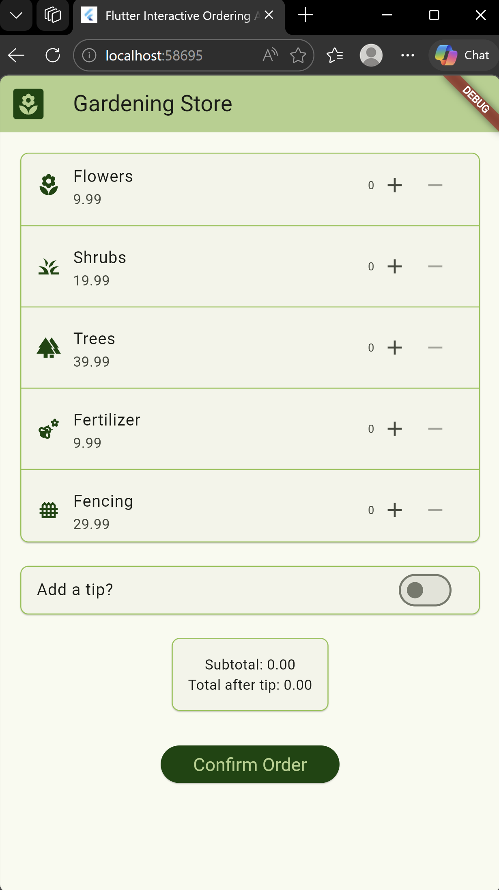
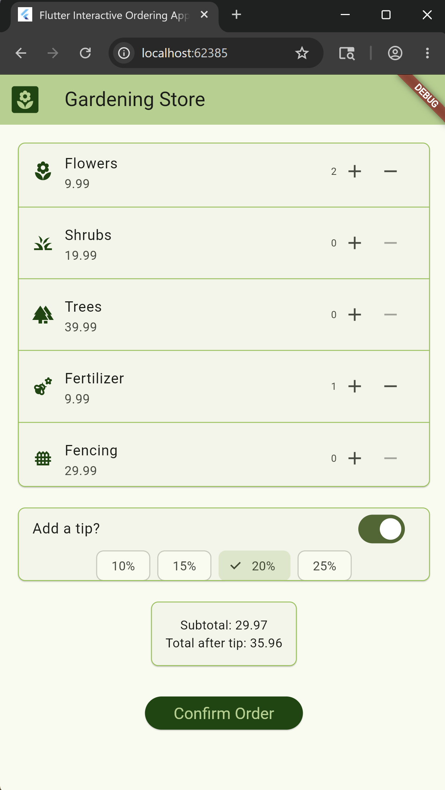
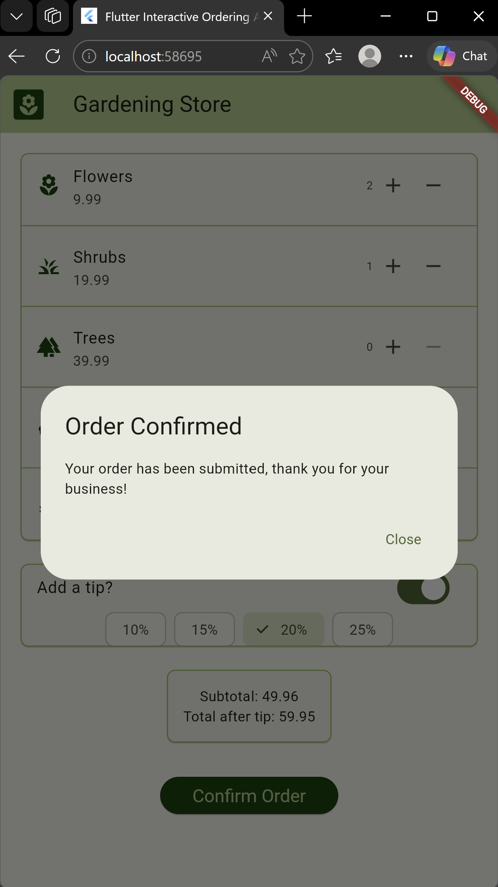

# Gardening Store Interactive Ordering Mobile Application Project

## COMP 5790 Mobile Applications Development: UI Fundamentals Assignment
### This project introduces core UI concepts implemented through a small interactive ordering app using Dart and Flutter. 
### Relevant project code can be found in `orderingapp/lib/main.dart`.

## Demonstration

#### Upon opening the app, users encounter a screen displaying items available to purchase from the Gardening Store. A user may choose to add or remove items of interest. 

#### After a user decides on their purchase, they may add a tip at their own discretion. They may also view their order's total cost, and make changes to their purchase selections and the tip percentage.

#### Once satisfied with their purchase, a user may confirm their order.

## Usage
* cd to the `orderingapp` directory in a terminal.
* Enter command `flutter run`.
* Select a device to view the app from.

## Project Requirements
* App must include a clear title and at least one image, logo, or visual element related to theme.
* Display at least 4 order items. Each item should include a name and price.
* Use state to allow the user to make at least one selection.
* Include at least one conditional UI element.
* Calculate and display a total price based on the user's selections.
* Include a confirmation button that shows an alert, dialog, or confirmation message when the order is submitted.
* Explore and use at least one new UI element or feature.
